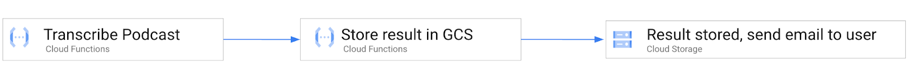
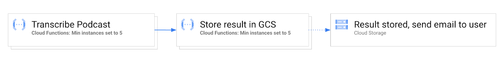

# Tutorial

This tutorial walks you through using the Cloud Functions minimal instances feature to mitigate cold starts.

Let’s take a deeper look at min instances using a real-world use case: transcribing a podcast. The demo application takes a "recorded" podcast, transcribes the "audio", writes the text into a Cloud Storage bucket, and then emails a link to the transcribed file.

> The recorded podcast is just a text file in order to keep the code simple.

This tutorial also aims to highlight the end-to-end latency differences between running functions with and without the min instances configuration set. 

## Prerequisites

This tutorial assumes you have access to the [Google Cloud Platform](https://cloud.google.com). You'll also need to clone this repository and use it as your working directory.

```
git clone https://github.com/kelseyhightower/cloud-functions-min-instances-tutorial.git
```

```
cd cloud-functions-min-instances-tutorial
```

## Approach 1: Base case, without min instances



In this approach, we use Cloud Functions and [Google Cloud Workflows](https://cloud.google.com/workflows) to chain together three individual cloud functions. The first function (transcribe), transcribes the podcast, the second function (store-transcription) consumes the result of the first function in the workflow and stores it in Cloud Storage , and the third function (send-email), is triggered by Cloud Storage after the transcribed file is writen, and sends an email to the user to inform them that the workflow is complete.


## Creating the Transcribe Function

This is the function which takes in an audio podcast and transcribes it into a text file.

```
PROJECT_ID=$(gcloud config get-value core/project)
```

Create the `transcribe-function` IAM service account:

```
TRANSCRIBE_SERVICE_ACCOUNT_EMAIL="transcribe-function@${PROJECT_ID}.iam.gserviceaccount.com"
```

```
gcloud iam service-accounts create transcribe-function
```

Deploy the `transcribe` function:

```
gcloud functions deploy transcribe \
  --allow-unauthenticated \
  --entry-point Transcribe \
  --runtime go113 \
  --trigger-http \
  --service-account ${TRANSCRIBE_SERVICE_ACCOUNT_EMAIL} \
  --source transcribe
```

### Testing the Transcribe Function

Post the `podcast.wav` file to the `transcribe` function using `curl`:

```
TRANSCRIBE_URL=$(gcloud functions describe transcribe \
  --format='value(httpsTrigger.url)')
```

```
curl -X POST ${TRANSCRIBE_URL} \
  -o podcast.txt \
  --data-binary @podcast.wav
```

> Results

Review the contents of the returned `podcast.txt` file:

```
cat podcast.txt
```

```
What's up YouTube? I'm Kelsey and welcome to my channel. Before we dive in please be sure to smash that like button and subscribe so you don't miss future videos.
```

## Create the Store Transcription Function

This is the function which writes the transcribed podcast obtained from the transcribe function into a cloud storage bucket. Once the file is stored in cloud storage, an event is fired to invoke a function which sends an email to the user.

```
PROJECT_ID=$(gcloud config get-value project)
```

Create the `store-transcription-function` IAM service account:

```
STORE_TRANSCRIPTION_SERVICE_ACCOUNT_EMAIL="store-transcription-function@${PROJECT_ID}.iam.gserviceaccount.com"
```

```
gcloud iam service-accounts create store-transcription-function
```

Create a storage bucket to hold text files:

```
TRANSCRIPTION_UPLOAD_BUCKET_NAME="${PROJECT_ID}-transcriptions"
```

```
gsutil mb gs://${TRANSCRIPTION_UPLOAD_BUCKET_NAME}
```

```
gsutil iam ch \
  serviceAccount:${STORE_TRANSCRIPTION_SERVICE_ACCOUNT_EMAIL}:objectAdmin \
  gs://${TRANSCRIPTION_UPLOAD_BUCKET_NAME}
```

Deploy the `store-transcription` function:

```
gcloud functions deploy store-transcription \
  --allow-unauthenticated \
  --entry-point StoreTranscription \
  --runtime go113 \
  --trigger-http \
  --service-account ${STORE_TRANSCRIPTION_SERVICE_ACCOUNT_EMAIL} \
  --set-env-vars="TRANSCRIPTION_UPLOAD_BUCKET_NAME=${TRANSCRIPTION_UPLOAD_BUCKET_NAME}" \
  --source store-transcription
```

### Test Transcription Uploads

List the files in the transcription upload bucket:

```
gsutil ls gs://${TRANSCRIPTION_UPLOAD_BUCKET_NAME}
```

> At this point the storage bucket should be empty.

Post the `podcast.txt` file to the `store-transcription` function using `curl`:

```
STORE_TRANSCRIPTION_URL=$(gcloud functions describe store-transcription \
  --format='value(httpsTrigger.url)')
```

```
curl -X POST ${STORE_TRANSCRIPTION_URL} \
  --data-binary @podcast.txt
```

List the files in the transcription upload bucket:

```
gsutil ls gs://${TRANSCRIPTION_UPLOAD_BUCKET_NAME}
```

> Output

```
gs://hightowerlabs-transcriptions/podcast.txt
```

At this point we have verified both the `transcribe` and `store-transcription` functions are working.

## Create the Send Email Function

This is a function which sends an email to a user notifying the user that the transcription of the podcast has been completed.

```
PROJECT_ID=$(gcloud config get-value project)
```

Create the `sendemail-function` IAM service account:

```
SEND_EMAIL_FUNCTION_SERVICE_ACCOUNT_EMAIL="sendemail-function@${PROJECT_ID}.iam.gserviceaccount.com"
```

```
gcloud iam service-accounts create sendemail-function
```

Deploy the `send-email` function:

```
gcloud functions deploy send-email \
  --allow-unauthenticated \
  --entry-point SendEmail \
  --runtime go113 \
  --trigger-resource ${TRANSCRIPTION_UPLOAD_BUCKET_NAME} \
  --trigger-event google.storage.object.finalize \
  --service-account ${SEND_EMAIL_FUNCTION_SERVICE_ACCOUNT_EMAIL} \
  --source send-email
```

### Testing the Send Email Function

```
STORE_TRANSCRIPTION_URL=$(gcloud functions describe store-transcription \
  --format='value(httpsTrigger.url)')
```

Post the `podcast.txt` file to the `store-transcription` function using `curl`:

```
curl -X POST ${STORE_TRANSCRIPTION_URL} \
  --data-binary @podcast.txt
```

Review the `send-email` function logs:

```
gcloud functions logs read send-email
```

> Output

```
LEVEL  NAME        EXECUTION_ID  TIME_UTC                 LOG
D      send-email  lhbh4r703djk  2021-07-14 17:17:32.665  Function execution took 3006 ms, finished with status: 'ok'
       send-email  lhbh4r703djk  2021-07-14 17:17:32.664  Email sent successfully
       send-email  lhbh4r703djk  2021-07-14 17:17:29.663  Sending email...
       send-email  lhbh4r703djk  2021-07-14 17:17:29.663  Processing send email request
D      send-email  lhbh4r703djk  2021-07-14 17:17:29.661  Function execution started
```

Notice the timestamps which help you track the functions end-to-end processing time.

## Create a Workflow

In this section you will create a Cloud Workflow to automated the execution of the podcast transcription pipeline.

> You can review the `workflow.yaml` file to see the details of the pipeline.

Deploy the `transcribe` workflow:

```
gcloud workflows deploy transcribe \
  --source workflow.yaml
```

Execute the `transcribe` workflow:

```
gcloud workflows run transcribe
```

Review each of the function logs to see the end to end execution of the pipeline:

```
gcloud functions logs read transcribe
```

```
LEVEL  NAME        EXECUTION_ID  TIME_UTC                 LOG
D      transcribe  6k258ardszq7  2021-08-13 06:26:05.026  Function execution took 6737 ms, finished with status code: 200
D      transcribe  6k258ardszq7  2021-08-13 06:25:58.290  Function execution started
```

```
gcloud functions logs read store-transcription
```

```
LEVEL  NAME                 EXECUTION_ID  TIME_UTC                 LOG
D      store-transcription  kunzo4g724ui  2021-08-13 06:26:08.075  Function execution took 2383 ms, finished with status code: 200
D      store-transcription  kunzo4g724ui  2021-08-13 06:26:05.692  Function execution started
```

```
gcloud functions logs read send-email
```

> Output

```
LEVEL  NAME        EXECUTION_ID  TIME_UTC                 LOG
D      send-email  e0sdnt52vlcf  2021-08-13 06:26:22.532  Function execution took 3013 ms, finished with status: 'ok'
       send-email  e0sdnt52vlcf  2021-08-13 06:26:22.529  Email sent successfully
       send-email  e0sdnt52vlcf  2021-08-13 06:26:19.528  Sending email...
```

Review the start and end timestamps of the entire transcription pipeline. The total runtime of Approach 1 took 17 seconds to complete.

> Each function is hardcoded with a 2 second delay during function initialization. When combined with the Cloud Functions average cold start time, almost half the time is spend starting each function.


## Approach 2: Setting Min Instance Configuration with your functions



In this approach, we follow all the same steps as in Approach 1, with the addition of setting the `--min-instances` flag for each function `transcribe` workflow.

Redeploy the `transcribe` function with the `--min-instances` flag set:

```
gcloud beta functions deploy transcribe \
  --allow-unauthenticated \
  --entry-point Transcribe \
  --runtime go113 \
  --trigger-http \
  --service-account ${TRANSCRIBE_SERVICE_ACCOUNT_EMAIL} \
  --source transcribe \
  --min-instances 5
```

Redeploy the `store-transcription` function with the `--min-instances` flag set:

```
gcloud beta functions deploy store-transcription \
  --allow-unauthenticated \
  --entry-point StoreTranscription \
  --runtime go113 \
  --trigger-http \
  --service-account ${STORE_TRANSCRIPTION_SERVICE_ACCOUNT_EMAIL} \
  --set-env-vars="TRANSCRIPTION_UPLOAD_BUCKET_NAME=${TRANSCRIPTION_UPLOAD_BUCKET_NAME}" \
  --source store-transcription \
  --min-instances 5
```

Redeploy the `send-email` function with the `--min-instances` flag set:

```
gcloud beta functions deploy send-email \
  --allow-unauthenticated \
  --entry-point SendEmail \
  --runtime go113 \
  --trigger-resource ${TRANSCRIPTION_UPLOAD_BUCKET_NAME} \
  --trigger-event google.storage.object.finalize \
  --service-account ${SEND_EMAIL_FUNCTION_SERVICE_ACCOUNT_EMAIL} \
  --source send-email \
  --min-instances 5
```

At this point each function in the `transcribe` workflow has been redeployed with the `--min-instances` flag set.

## Re-run the Workflow with Min Instances

Re-run the `transcribe` workflow to warm up the functions. This ensures all functions have been initialized and ready to receive requests. 

```
gcloud workflows run transcribe
```

Run the `transcribe` workflow again. You should see a significant improvement in the end-to-end runtime of the transcription pipeline.

```
gcloud workflows run transcribe
```

Review the function logs:

```
gcloud functions logs read transcribe
```

> Output

```
LEVEL  NAME        EXECUTION_ID  TIME_UTC                 LOG
D      transcribe  yu0magytxdyb  2021-08-13 06:26:17.843  Function execution took 5005 ms, finished with status code: 200
D      transcribe  yu0magytxdyb  2021-08-13 06:26:12.839  Function execution started
```

```
gcloud functions logs read store-transcription
```

> Output

```
LEVEL  NAME                      EXECUTION_ID  TIME_UTC                 LOG
D      store-transcription  ci24ipm9d1c9  2021-08-13 06:26:18.345  Function execution took 397 ms, finished with status code: 200
D      store-transcription  ci24ipm9d1c9  2021-08-13 06:26:17.948  Function execution started
```

```
gcloud functions logs read send-email
```

> Output

```
LEVEL  NAME        EXECUTION_ID  TIME_UTC                 LOG
D      send-email  f0gtxaktn5ce  2021-08-13 06:26:22.527  Function execution took 3009 ms, finished with status: 'ok'
       send-email  f0gtxaktn5ce  2021-08-13 06:26:22.526  Email sent successfully
       send-email  f0gtxaktn5ce  2021-08-13 06:26:19.525  Sending email...

```

Now we can compare the total runtime between Approach 1 and 2. The total runtime of Approach 2 is 6 seconds, which is 11 seconds faster than Approach 1, which does not leverage the min instances feature. Approach 2 avoids cold starts and the additional function initialization overhead, and should provide a more constant runtime experience. 
